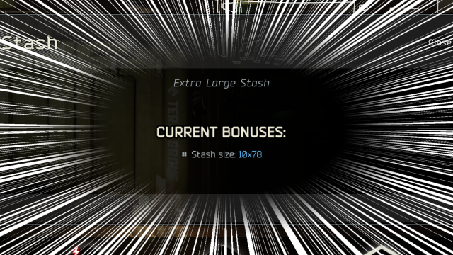

Sizin' Stashes (for JET v1.1.0)
----------------
Version `1.1.0` (`03.13.2021`)
By Kyodan

This mod allows you to resize the height of stashes however you want!

**Download the latest release (in ZIP format) here: https://github.com/KyodanCFG/SizinStashes/releases**
                                                                     
## Info

- By default, this mod will enable itself, and increase by 10 the stash height for each edition of the game
    * `Standard` from `28` to 38`
    * `Left Behind` from `38` to `48`
    * `Prepare to Escape` from `48` to `58`
    * `Edge of Darkness` from `68` to `78`

## Installation

1. Extract archive to your `server folder/user/mods` folder 
    * Folder structure should look like `server folder/user/mods/Kyodan-SizinStashes-X.X.X`
2. Close your server (if it's running)
3. Edit `settings.json` in your preferred text editor/IDE, review/modify any settings, then save and close
4. Delete your `server folder/user/cache` folder
5. Run your server (it should generate a new cache)

* If you change a setting in `settings.json`, repeat steps 2-5 above

## Settings

- Below are the default settings:
    * "`sizinStashes`": true,
    * "`standard`": 38,
    * "`leftBehind`": 48,
    * "`prepareToEscape`": 58,
    * "`edgeOfDarkness`": 78

- Below are the flags for each setting:
    * `sizinStashes` (`true`|`false`)           - determines if this script is enabled/disabled
    * `standard` (`number`)                     - determines how tall (in units) the 'Standard' stash will be
    * `leftBehind` (`number`)                   - determines how tall (in units) the 'Left Behind' stash will be
    * `prepareToEscape` (`number`)              - determines how tall (in units) the 'Prepare to Escape' stash will be
    * `edgeOfDarkness` (`number`)               - determines how tall (in units) the 'Edge of Darkness' stash will be

## Files

- If any of the files below are missing/misplaced, you may have to redownload/reinstall this archive:
    * src/Sizin.js
    * mod.config.json
    * settings.json
    * readme.md
    
## Need help?

1. Join the EmuTarkov Discord: https://discord.gg/33r4FPp
2. @ me in the #support channel which script + version, what the issue is, and a picture/log of that issue (if possible)

## Disclaimer

I am not responsible for any data loss in relation to the use of this mod (including, but not limited to game/profile data and/or content loss, damage caused to your software, computer, or mobile device). I encourage you to back up your server/profile data before using this mod.

## Changelog

- 03.13.21
    * Initial push to Github
    
- 01.26.21
    * Fixed error messages not working properly
    * Simplified/tidied up some strings
